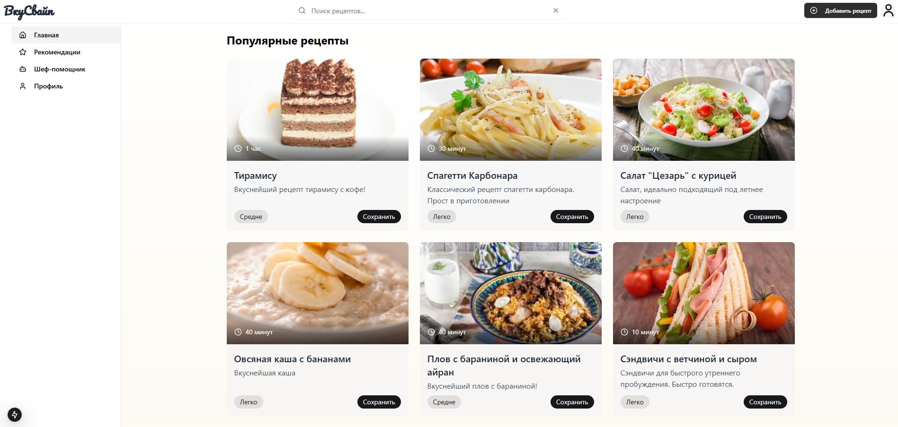
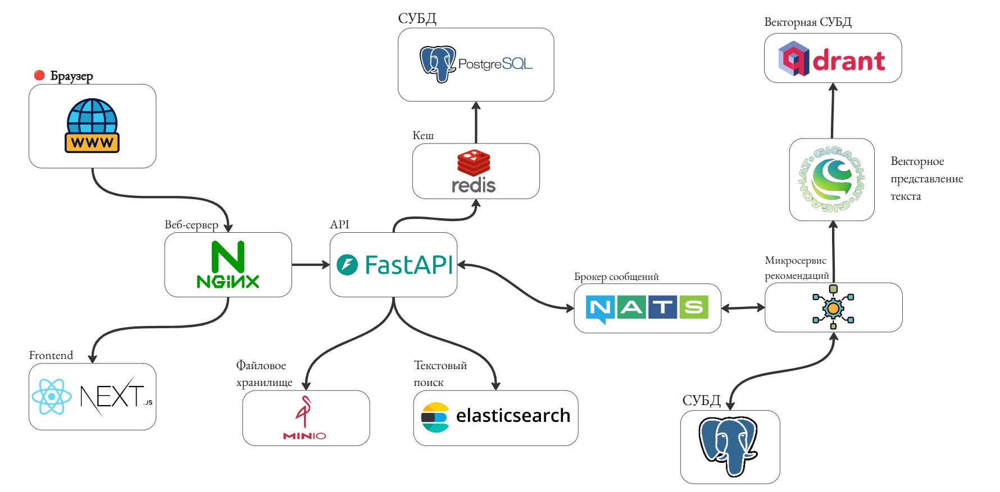

# 🍳 Платформа для рецептов "Вкусвайп"

**Вкусвайп** — это современная социальная сеть для любителей кулинарии, объединяющая создание, поиск и персонализированные рекомендации рецептов. Платформа использует микросервисную архитектуру с интеллектуальной системой рекомендаций на основе эмбеддингов.



## ✨ Ключевые возможности

- 👤 **Управление пользователями**: регистрация, аутентификация, профили пользователей
- 📝 **Создание рецептов**: добавление рецептов с изображениями, инструкциями и тегами
- 🔍 **Умный поиск**: полнотекстовый поиск рецептов с использованием Elasticsearch
- 🎯 **Персонализированные рекомендации**: ML-алгоритмы на основе предпочтений пользователей
- ❤️ **Социальные функции**: лайки, дизлайки, избранные рецепты
- 🖼️ **Медиа-хранилище**: загрузка и хранение изображений рецептов

## 📋 Содержание

- [Архитектура системы](#-архитектура-системы)
- [Инструкции по запуску](#-инструкции-по-запуску)
  - [Требования к системе](#требования-к-системе)
  - [Установка и настройка](#установка-и-настройка)
  - [Development режим](#development-режим)
  - [Production режим](#production-режим)
- [API документация](#-api-документация)
- [Структура проекта](docs/STRUCTURE.md)
- [Технологический стек](docs/TECH_STACK.md)
- [Переменные окружения](docs/ENV_VARIABLES.md)
- [Алгоритм рекомендаций](docs/RECOMMENDATION_ALGORITHM.md)
- [Руководство по разработке](docs/DEVELOPMENT.md)

## 🏗 Архитектура системы



### Основные компоненты:

1. **Frontend (Next.js)** - пользовательский интерфейс
2. **Backend API (FastAPI)** - основная бизнес-логика и API
3. **Recsys Worker (FastStream)** - микросервис рекомендаций
4. **NATS** - асинхронная связь между сервисами
5. **PostgreSQL** - хранение структурированных данных
6. **Elasticsearch** - поиск по рецептам
7. **Qdrant** - векторный поиск для рекомендаций
8. **Redis** - кэширование и сессии
9. **MinIO** - хранение изображений

## 🚀 Инструкции по запуску

### Требования к системе

- **Docker** `20.10+` и **Docker Compose** `2.0+`
- **Git** для клонирования репозитория
- Минимум **8GB RAM** для комфортной работы всех сервисов
- Свободное место на диске: **5GB+**

### Установка и настройка

1. **Клонирование репозитория**
   ```bash
   git clone <repository-url>
   cd food-social-network
   ```

2. **Настройка переменных окружения**

   Скопируйте содержимое файла `.env.example` в файл `.env` в корне проекта:
   ```bash
   cp .env.example .env
   ```
   Для детальной настройки .env смотрите 
3. **Запустите контейнеры с помощью `docker-compose`**
   ```bash
   docker compose up --build
   ```

### Доступные URL в development режиме

- **Frontend**: http://localhost:3000
- **Backend API**: http://localhost:8000
- **API Документация (Swagger)**: http://localhost:8000/docs
- **Recsys AsyncAPI Docs**: http://localhost:8001/docs/asyncapi
- **Elasticsearch**: http://localhost:9200
- **MinIO Console**: http://localhost:9001
- **Qdrant Dashboard**: http://localhost:6333/dashboard
=
### Полезные команды

#### Остановка сервисов

1. **Остановка всех сервисов**
   ```bash
   docker-compose down
   ```

2. **Остановка с удалением данных (ОСТОРОЖНО: удалит все данные)**
   ```bash
   docker-compose down -v
   ```

#### Пересборка и перезапуск

3. **Пересборка конкретного сервиса**
   ```bash
   docker-compose build backend
   ```

4. **Перезапуск сервиса после пересборки**
   ```bash
   docker-compose up -d backend
   ```

#### Выполнение команд в контейнерах

5. **Подключение к bash в backend контейнере**
   ```bash
   docker-compose exec backend bash
   ```

6. **Выполнение Python команды в recsys контейнере**
   ```bash
   docker-compose exec recsys-worker python -c "print('Hello from recsys!')"
   ```

#### Мониторинг и диагностика

7. **Просмотр процессов в контейнерах**
   ```bash
   docker-compose top
   ```

8. **Мониторинг использования ресурсов**
   ```bash
   docker stats
   ```

#### Очистка системы

9. **Очистка неиспользуемых Docker ресурсов**
   ```bash
   docker system prune -a
   ```

## 📚 API документация

### Backend API Endpoints

Основные группы API endpoints:

#### 🔐 Аутентификация (`/api/v1/auth`)
- `POST /auth/register` - регистрация нового пользователя
- `POST /auth/login` - вход в систему
- `POST /auth/refresh` - обновление access токена

#### 👤 Пользователи (`/api/v1/users`)
- `GET /users/me` - получение профиля текущего пользователя
- `PATCH /users/me` - обновление профиля
- `POST /users/me/avatar` - загрузка аватара
- `GET /users/{user_id}/recipes` - рецепты пользователя

#### 📝 Рецепты (`/api/v1/recipes`)
- `GET /recipes` - список рецептов с пагинацией
- `POST /recipes` - создание нового рецепта
- `GET /recipes/{recipe_id}` - детальная информация о рецепте
- `PATCH /recipes/{recipe_id}` - обновление рецепта
- `DELETE /recipes/{recipe_id}` - удаление рецепта
- `POST /recipes/{recipe_id}/impression` - отметка просмотра рецепта

#### 🔍 Поиск (`/api/v1/recipes/search`)
- `GET /recipes/search` - поиск рецептов по различным критериям

#### 🎯 Рекомендации (`/api/v1/recommendations`)
- `GET /recommendations` - персонализированные рекомендации

#### ❤️ Избранное и дизлайки
- `GET /favorite-recipes` - избранные рецепты пользователя
- `POST /favorite-recipes` - добавление в избранное
- `DELETE /favorite-recipes/{recipe_id}` - удаление из избранного
- `GET /disliked-recipes` - дизлайкнутые рецепты
- `POST /disliked-recipes` - добавление дизлайка
- `DELETE /disliked-recipes/{recipe_id}` - удаление дизлайка

### Recsys Microservice (NATS RPC)

#### Рекомендации
- `recsys.get_recommendations` - получение персонализированных рекомендаций

#### Управление рецептами
- `tasks.add_recipe` - добавление рецепта в систему рекомендаций
- `tasks.update_recipe` - обновление данных рецепта
- `tasks.delete_recipe` - удаление рецепта
- `tasks.publish_recipe` - публикация рецепта

#### Обратная связь
- `tasks.add_feedback` - добавление лайка/дизлайка
- `tasks.add_impression` - отметка просмотра рецепта
- `tasks.add_impressions_bulk` - массовое добавление просмотров


---

## 🦊 Разработано с любовью!

Этот проект создан с особой заботой о качестве кода, производительности и пользовательском опыте. Если у вас есть вопросы или предложения по улучшению, не стесняйтесь создавать issues или pull requests!

**Приятного пользования!** 🍳✨
