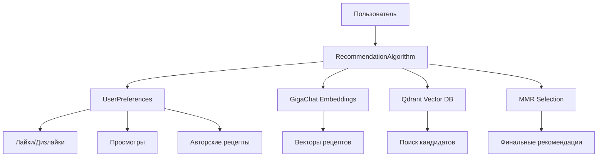
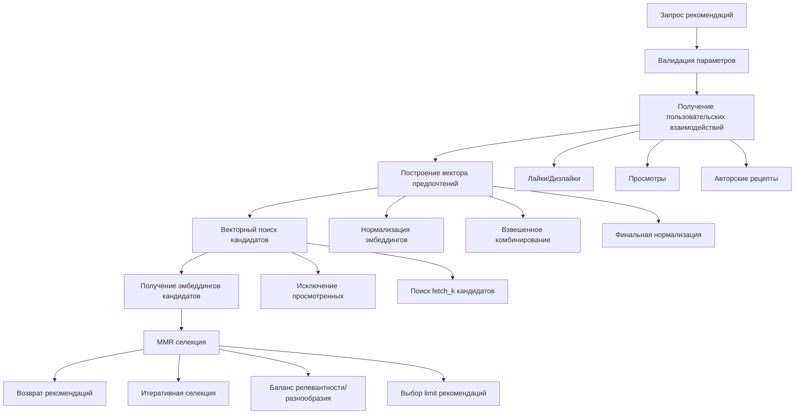

# 🤖 Алгоритм рекомендаций

Этот документ содержит подробное описание алгоритма рекомендаций, используемого в проекте "Вкусвайп" для персонализированных рекомендаций рецептов.

## 📋 Содержание

- [Обзор системы рекомендаций](#-обзор-системы-рекомендаций)
  - [Назначение и цели](#назначение-и-цели)
  - [Архитектурный подход](#архитектурный-подход)
  - [Основные компоненты](#основные-компоненты)
- [Алгоритм MMR (Maximal Marginal Relevance)](#-алгоритм-mmr-maximal-marginal-relevance)
  - [Математическая формула](#математическая-формула)
  - [Параметры алгоритма](#параметры-алгоритма)
  - [Принцип работы](#принцип-работы)
  - [Преимущества использования](#преимущества-использования)
- [Технические детали реализации](#-технические-детали-реализации)
  - [Векторные эмбеддинги через GigaChat](#векторные-эмбеддинги-через-gigachat)
  - [Работа с Qdrant векторной базой данных](#работа-с-qdrant-векторной-базой-данных)
  - [Обработка пользовательских предпочтений](#обработка-пользовательских-предпочтений)
  - [Фильтрация просмотренных рецептов](#фильтрация-просмотренных-рецептов)
- [Процесс генерации рекомендаций](#-процесс-генерации-рекомендаций)
  - [Пошаговый алгоритм](#пошаговый-алгоритм)
  - [Входные параметры](#входные-параметры)
  - [Выходные данные](#выходные-данные)

## 🎯 Обзор системы рекомендаций

### Назначение и цели

Система рекомендаций "Вкусвайп" предназначена для:

- 🎯 **Персонализированные рекомендации** - предоставление релевантных рецептов на основе предпочтений пользователя
- 🔄 **Разнообразие контента** - обеспечение разнообразия в рекомендациях для избежания "пузыря фильтров"
- 📈 **Улучшение пользовательского опыта** - повышение вовлеченности через качественные рекомендации
- 🧠 **Машинное обучение** - использование современных ML подходов для анализа предпочтений

### Архитектурный подход

Система построена на основе **гибридного подхода**, сочетающего:

1. **Content-Based Filtering** - анализ содержимого рецептов через эмбеддинги
2. **MMR алгоритм** - балансировка релевантности и разнообразия
3. **Векторный поиск** - быстрый поиск похожих рецептов в высокоразмерном пространстве

### Основные компоненты



## 🧮 Алгоритм MMR (Maximal Marginal Relevance)

### Математическая формула

MMR использует следующую формулу для выбора рекомендаций:

```
MMR = λ × Relevance(q, d) - (1 - λ) × max[Similarity(d, di)]
```

Где:
- **λ (lambda_mult)** - параметр баланса между релевантностью и разнообразием [0, 1]
- **Relevance(q, d)** - релевантность документа d к запросу q
- **Similarity(d, di)** - максимальная схожесть с уже выбранными документами
- **q** - вектор предпочтений пользователя
- **d** - кандидат для рекомендации
- **di** - уже выбранные рекомендации

### Параметры алгоритма

#### `lambda_mult` (λ) - Баланс релевантности и разнообразия

- **Диапазон**: [0.0, 1.0]
- **По умолчанию**: 0.5
- **Влияние**:
  - `λ = 1.0` - максимальная релевантность, минимальное разнообразие
  - `λ = 0.0` - максимальное разнообразие, минимальная релевантность
  - `λ = 0.5` - сбалансированный подход

#### `fetch_k` - Количество кандидатов

- **Диапазон**: [limit, 200]
- **По умолчанию**: 20
- **Назначение**: количество кандидатов для MMR селекции

#### `limit` - Количество рекомендаций

- **Диапазон**: [1, 100]
- **По умолчанию**: 10
- **Назначение**: финальное количество рекомендаций

### Принцип работы

1. **Получение кандидатов** - векторный поиск находит `fetch_k` наиболее релевантных рецептов
2. **Итеративная селекция** - MMR последовательно выбирает рецепты, максимизируя формулу
3. **Контроль разнообразия** - каждый новый выбор учитывает схожесть с уже выбранными
4. **Финальный результат** - `limit` рекомендаций с оптимальным балансом

### Преимущества использования

- ✅ **Избежание дублирования** - предотвращает рекомендации очень похожих рецептов
- ✅ **Контролируемое разнообразие** - настраиваемый баланс через параметр λ
- ✅ **Высокое качество** - сохраняет релевантность при увеличении разнообразия
- ✅ **Масштабируемость** - эффективно работает с большими объемами данных

## 🔧 Технические детали реализации

### Векторные эмбеддинги через GigaChat

Система использует **GigaChat API** для генерации семантических эмбеддингов:

```python
# Генерация эмбеддинга для рецепта
embedding = await embeddings_repo.get_embedding(f"{title}, {tags}")
```

**Характеристики эмбеддингов**:
- **Размерность**: 1024 измерения
- **Тип**: Dense векторы с плавающей точкой
- **Нормализация**: L2 нормализация для косинусного расстояния
- **Контекст**: Название рецепта + теги

### Работа с Qdrant векторной базой данных

**Qdrant** используется для хранения и быстрого поиска векторов:

```python
# Конфигурация коллекции
vectors_config = VectorParams(size=1024, distance=Distance.COSINE)

# Поиск кандидатов
candidates = await qdrant_repo.get_recommendations(
    query_vector=user_vector,
    limit=fetch_k,
    exclude_ids=exclude_ids
)
```

**Особенности**:
- **Метрика расстояния**: Косинусное расстояние
- **Индексация**: HNSW для быстрого приближенного поиска
- **Фильтрация**: Исключение просмотренных рецептов
- **Масштабируемость**: Поддержка миллионов векторов

### Обработка пользовательских предпочтений

Система анализирует **5 типов пользовательских взаимодействий**:

```python
class UserPreferences:
    favorite_recipes_ids: list[int]      # Лайкнутые рецепты
    disliked_recipes_ids: list[int]      # Дизлайкнутые рецепты
    viewed_recipes_ids: list[int]        # Просмотренные рецепты
    recs_detail_recipes_ids: list[int]   # Детально просмотренные из рекомендаций
    author_recipes_ids: list[int]        # Авторские рецепты пользователя
```

**Алгоритм построения вектора предпочтений**:

1. **Нормализация эмбеддингов** - каждый вектор нормализуется по L2 норме
2. **Усреднение по категориям** - вычисляется средний вектор для каждого типа взаимодействий
3. **Взвешенное комбинирование**:
   ```python
   user_vector = liked_emb * 2.0           # Лайки: вес 2.0
                - disliked_emb * 1.0       # Дизлайки: вес -1.0
                + viewed_emb * 0.2         # Просмотры: вес 0.2
                + recs_detail_emb * 0.2    # Детальные просмотры: вес 0.2
   ```
4. **Финальная нормализация** - итоговый вектор нормализуется

**Веса взаимодействий**:
- 🔥 **Лайки (2.0)** - наибольший положительный вес
- 👎 **Дизлайки (-1.0)** - отрицательный вес для исключения
- 👀 **Просмотры (0.2)** - слабый положительный сигнал
- 🔍 **Детальные просмотры (0.2)** - интерес к рекомендациям

### Фильтрация просмотренных рецептов

Система автоматически исключает из рекомендаций:

```python
exclude_ids = (
    user_preferences.favorite_recipes_ids +      # Уже лайкнутые
    user_preferences.disliked_recipes_ids +      # Дизлайкнутые
    user_preferences.author_recipes_ids          # Собственные рецепты
)
```

**Опциональная фильтрация** (параметр `exclude_viewed`):
- ✅ **Включена по умолчанию** - исключает просмотренные рецепты
- ❌ **Отключена** - может показывать ранее просмотренные рецепты

## 🔄 Процесс генерации рекомендаций

### Пошаговый алгоритм



### Входные параметры

```python
async def get_recommendations(
    user_id: int,                    # ID пользователя
    limit: int = 10,                 # Количество рекомендаций
    fetch_k: int = 20,               # Количество кандидатов для MMR
    lambda_mult: float = 0.5,        # Баланс релевантности/разнообразия
    exclude_viewed: bool = True      # Исключать просмотренные рецепты
) -> list[dict]:
```

**Валидация параметров**:
- `user_id > 0` - положительный ID пользователя
- `limit > 0` - положительное количество рекомендаций
- `fetch_k >= limit` - кандидатов не меньше чем рекомендаций
- `0 <= lambda_mult <= 1` - параметр λ в допустимом диапазоне

### Выходные данные

```python
[
    {
        "recipe_id": 123,           # ID рецепта
        "score": 0.85,              # MMR оценка [0, 2]
        "payload": {                # Дополнительные данные (опционально)
            "title": "Борщ классический",
            "tags": "суп, овощи, мясо"
        }
    },
    # ... остальные рекомендации
]
```

**Характеристики оценок**:
- **Диапазон**: [0.0, 2.0]
- **Интерпретация**: чем выше оценка, тем лучше рекомендация
- **Сортировка**: рекомендации отсортированы по убыванию оценки

### Рекомендации по настройке

| Параметр | Низкое значение | Высокое значение | Рекомендация |
|----------|----------------|------------------|--------------|
| `lambda_mult` | Больше разнообразия | Больше релевантности | 0.5 для баланса |
| `fetch_k` | Быстрее работа | Лучшее качество | 2-5x от limit |
| `limit` | Быстрее загрузка | Больше выбора | 10-15 оптимально |
